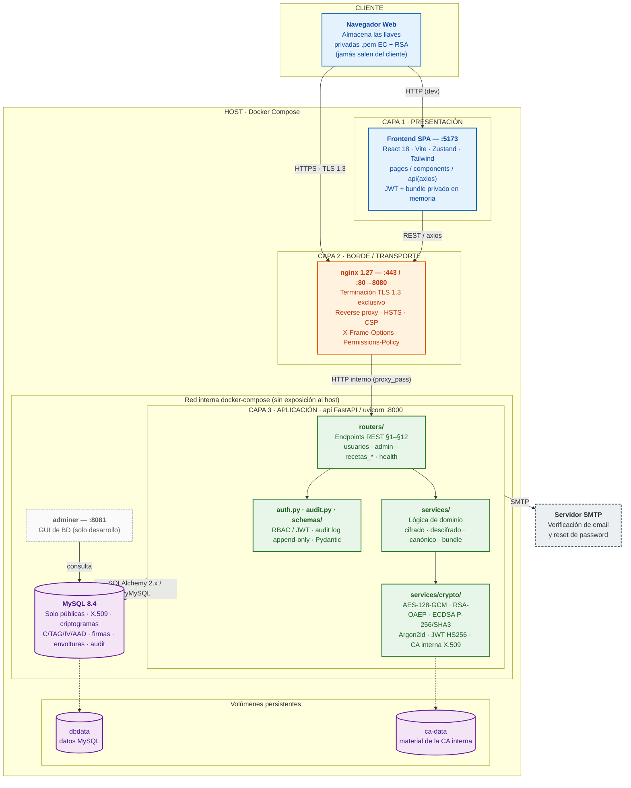

# SecureRx — Diagrama de Arquitectura

Sistema de recetas electrónicas con criptografía real. Arquitectura cliente-servidor
de tres capas, contenerizada con Docker Compose, detrás de un reverse proxy con
terminación TLS 1.3.

---

## Diagrama de arquitectura (vista de despliegue + capas)

---

## Leyenda

| Color | Capa |
|---|---|
| Azul | Cliente / Presentación — navegador y SPA |
| Naranja | Borde / Transporte — nginx, terminación TLS 1.3 |
| Verde | Aplicación — API FastAPI y subcomponentes |
| Morado | Persistencia — MySQL y volúmenes |
| Gris (punteado) | Servicios externos y herramientas de desarrollo |

## Notas de arquitectura

- **nginx es la única entrada pública.** El `api` solo se publica por `expose` y
  MySQL nunca se publica: ambos viven en la red interna de docker-compose.
- **TLS 1.3 exclusivo** (sin fallback a 1.2), HSTS y CSP los aplica nginx.
- **El frontend (Vite) corre en el host**, no en contenedor.
- **Regla de oro:** las llaves privadas y la DEK nunca tocan el disco del
  servidor; la BD solo guarda públicas, certificados X.509, criptogramas,
  firmas, envolturas y el audit log.
- **Criptografía transversal:** AES-128-GCM (cifrado), RSA-OAEP (envoltura de
  clave), ECDSA P-256/SHA3-256 (firma), Argon2id (password), JWT HS256 (sesión),
  CA interna X.509 (certificación).
